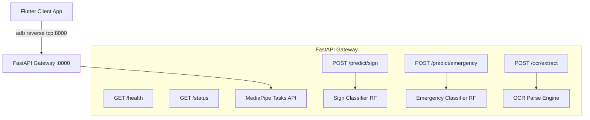

# MediSign-AI: System Architecture Design

This document details the unified system architecture, logical communications, data flow pipelines, and migration strategies for MediSign-AI.

---

## 1. Target Unified Architecture (Single FastAPI Gateway)

To eliminate the overhead of maintaining two separate Python servers and managing multiple port forwarding tunnels, the system is designed to use a **single FastAPI Gateway** running on port `8000`. 

This gateway hosts:
1. **Sign Language Recognition Module**: Serves static Indian Sign Language letter predictions.
2. **Emergency Gesture Recognition Module**: Serves real-time emergency alert predictions.
3. **Prescription OCR Module**: Serves prescription OCR and structured text extraction.

---

## 2. Flask to FastAPI Migration Path

Since Flask (`backend/app.py`) is already working on port `5000` with the letter-prediction model (`gesture_model_full.pkl`), it will be migrated to the FastAPI gateway on port `8000`:

1. **Model Relocation**: Copy or reference the sign language model `gesture_model_full.pkl` inside the FastAPI `models/` directory.
2. **Code Porting**:
   - Port the preprocessing helper `normalize()` and wrist-centering `extract_hand()` from Flask to FastAPI.
   - Port the word-building variables (`recent_predictions`, `current_word`, `last_confirmed_letter`) to an in-memory session dict inside the FastAPI application, keyed by client host or API session ID.
3. **Endpoint Creation**: Implement `POST /predict/sign` using FastAPI syntax, matching the request/response shape expected by the client.
4. **Shutdown Flask**: Decommission the Flask backend once routing and prediction checks on the FastAPI server are verified.

---

## 3. Communication Protocols

All client traffic is routed through a single port mapping:

| Route | Protocol | Format | Description |
| :--- | :--- | :--- | :--- |
| `GET /health` | HTTP GET | JSON | Gateway availability and liveness monitor. |
| `GET /status` | HTTP GET | JSON | Status indicator showing model-loading and configurations. |
| `POST /predict/sign` | HTTP POST | JSON (base64) | Submits frame, returns Indian Sign Language letter prediction. |
| `POST /predict/emergency`| HTTP POST | Multipart / JSON | Submits frame, returns emergency category + alerts. |
| `POST /ocr/extract` | HTTP POST | Multipart | Submits snapped image, returns structured medicine labels. |

---

## 4. Physical ADB Bridge Routing

The mobile device connects via USB tethering:
* Command to run: `adb reverse tcp:8000 tcp:8000`
* Mobile client targets local hostname: `http://127.0.0.1:8000` (which is reverse-mapped to the laptop host port 8000).
* If connection drops, the mobile Connection Monitor triggers recovery processes.
